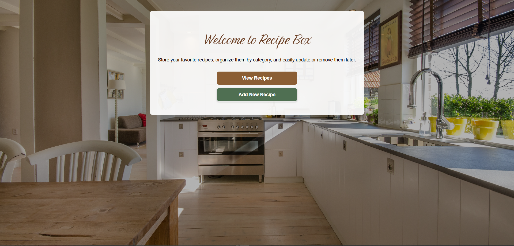
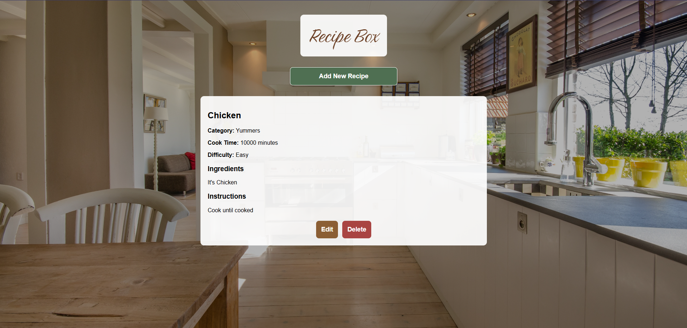
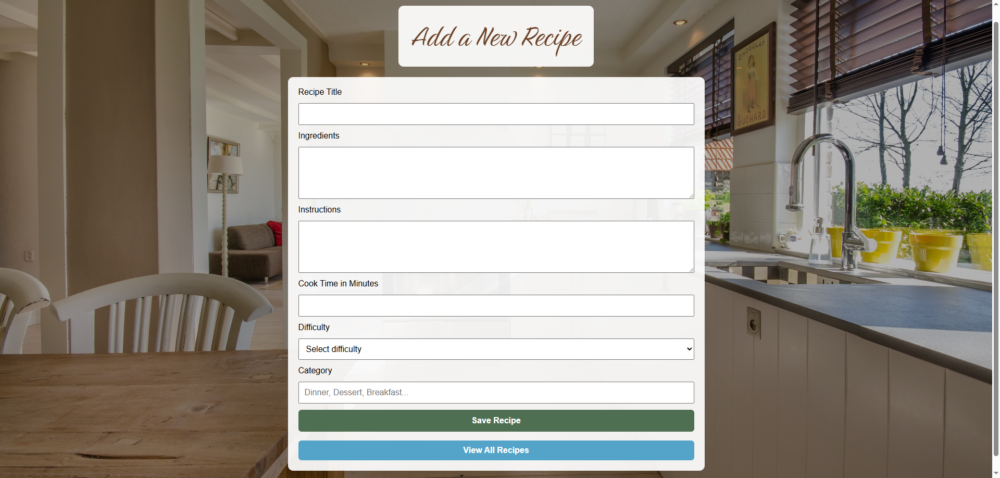
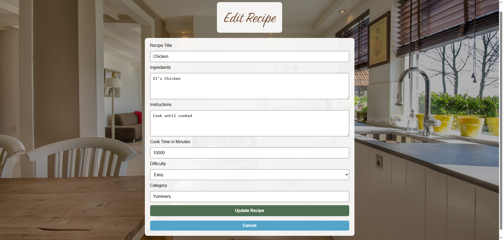
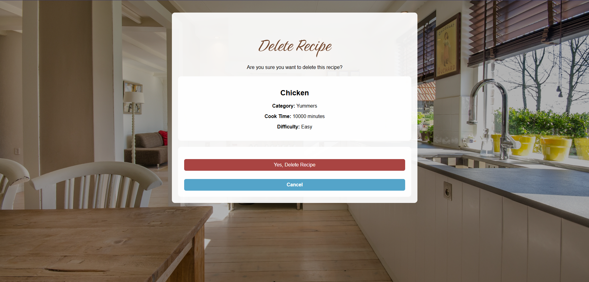

# 🍽️ RecipeBox

## 📌 Description

RecipeBox is a full-stack CRUD web application built with Node.js, Express, MongoDB Atlas, and Mongoose. Users can create, view, update, and delete recipes through a clean, responsive interface. The application demonstrates server-side rendering, database integration, form handling, and deployment-ready architecture.

---

## 🚀 Features

* Create new recipes using HTML forms
* View all saved recipes in a recipe collection
* Edit existing recipes
* Delete recipes with confirmation page
* Form validation using Mongoose schema rules
* Success page feedback after Create, Update, and Delete operations
* Responsive design for desktop and mobile devices
* MongoDB Atlas cloud database integration
* Server-side rendering using EJS templates

---

## 📸 Screenshots

### Home Page



### Recipe List



### Add Recipe



### Edit Recipe



### Delete Confirmation



---

## 🧩 User Stories

* As a user, I want to create recipes so I can save my favorite meals.
* As a user, I want to view all recipes in one place.
* As a user, I want to edit existing recipes when I improve or modify them.
* As a user, I want to delete recipes I no longer need.
* As a user, I want confirmation messages after important actions.

---

## 🛠️ Technologies Used

### Front-End

* HTML5
* CSS3
* EJS

### Back-End

* Node.js
* Express v5

### Database

* MongoDB Atlas
* Mongoose

### Development Tools

* VS Code
* Git
* GitHub

---

## ⚙️ Installation & Setup

### 1. Clone the Repository

```bash
git clone https://github.com/your-username/PracticeProject_RecipeBox.git
```

### 2. Open the Project Folder

```bash
cd PracticeProject_RecipeBox
```

### 3. Install Dependencies

```bash
npm install
```

### 4. Create a .env File

Create a `.env` file in the root directory:

```env
MONGODB_URI=your_mongodb_connection_string
PORT=3000
```

### 5. Start the Application

```bash
npm start
```

### 6. Open the Browser

```txt
http://localhost:3000
```

---

## ▶️ Usage

### Create a Recipe

1. Click **Add New Recipe**
2. Fill out the recipe form
3. Click **Save Recipe**

### Edit a Recipe

1. Navigate to the recipe list
2. Click **Edit**
3. Update recipe information
4. Click **Update Recipe**

### Delete a Recipe

1. Click **Delete**
2. Confirm deletion
3. Recipe is permanently removed

---

## 📂 Project Structure

```txt
PracticeProject_RecipeBox/
│
├── assets/
│   └── screenshot-views.png
│
├── config/
│   └── db.js
│
├── models/
│   └── Recipe.js
│
├── public/
│   ├── images/
│   └── styles.css
│
├── views/
│   ├── home.ejs
│   ├── create.ejs
│   ├── list.ejs
│   ├── edit.ejs
│   ├── delete.ejs
│   └── success.ejs
│
├── .env
├── .gitignore
├── app.js
├── server.js
├── package.json
└── README.md
```

---

## 🗄️ Recipe Schema

```javascript
{
  title: String,
  ingredients: String,
  instructions: String,
  cookTime: Number,
  difficulty: String,
  category: String
}
```

---

## 🧠 What I Learned

* Building full-stack applications with Express and MongoDB
* Connecting a cloud database using MongoDB Atlas
* Creating Mongoose schemas and validation rules
* Performing CRUD operations with server-side routes
* Processing HTML form submissions with Express middleware
* Rendering dynamic content using EJS
* Organizing projects using a modular file structure
* Managing environment variables securely with dotenv
* Improving UI design with custom CSS and responsive layouts

---

## 🔮 Future Improvements

* Recipe image uploads
* Search recipes by title
* Filter recipes by category
* Favorite recipes functionality
* Recipe ratings and reviews
* User authentication and personal recipe collections
* Pagination for large recipe collections

---

## 🌐 Live Demo

Deployment link will be added after deployment.

---

## 👤 Author

Amanda McIntire

---

## 📄 License

This project was created as part of an AI-Centric Software Engineering bootcamp and is intended for educational and portfolio purposes.